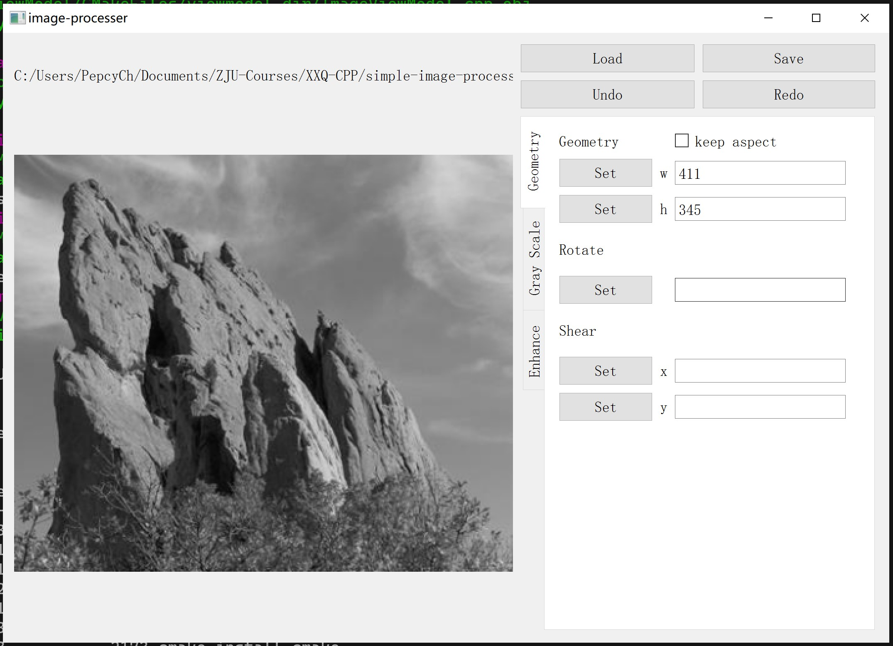

# simple-image-processer

* 组员：陈昱文、张辛宁、贺情怡
* 选题：图像处理应用

## 开发环境

* 语言：C++ 17
* 第三方库
  * Qt 5.14.2
  * stb（`stb_image.h` & `stb_image_write.h`）
* 构建：CMake
* 版本控制及协作：Git + GitHub
* 文档：Markdown
* 组员沟通：QQ

## 项目描述

实现一个简单的图像处理应用，该应用能够对现有的图像（.png、.jpg 等格式）进行编辑，有操作简单、良好的用户界面，能使得多种图像操作条理清楚。

### 功能实现

* 图像的导入导出
* 操作的撤销重做
* 黑白图像操作（黑白化、全局二值化、局部二值化）
* 图像增强（锐化、模糊、均衡化）
* 图像的几何变换（旋转、缩放、切变）

### 界面设计

## 具体实现

### MVVM 架构

Common

* 图像类及一些辅助函数

Model

* 图像（用一个容器记录历史图像实现撤销重做）
* 图像操作函数

View

* 绘制 UI 和链接按钮等的事件
* 调用的只是一个 `std::function<>` 变量

ViewModel

* 持有 Model 并向 View 提供真正的函数（命令）内容

App

* 创建以上的对象并调用它们的函数进行需要的绑定操作

### 迭代

* [x] 第一轮迭代
  * [x] 简单的界面
  * [x] 图像的导入导出
* [x] 第二轮迭代
  * [x] 黑白化
  * [x] 全局二值化
  * [x] 局部二值化
* [x] 第三轮迭代
  * [x] 锐化
  * [x] 模糊
  * [x] 均衡化
  * [x] 显示直方图
* [x] 第四轮迭代
  * [x] 缩放
  * [x] 等比例缩放
  * [x] 旋转
  * [x] 切变
* 第五轮迭代（可能）
  * 改善界面、交互